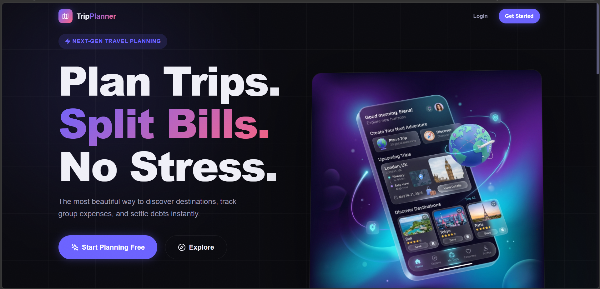
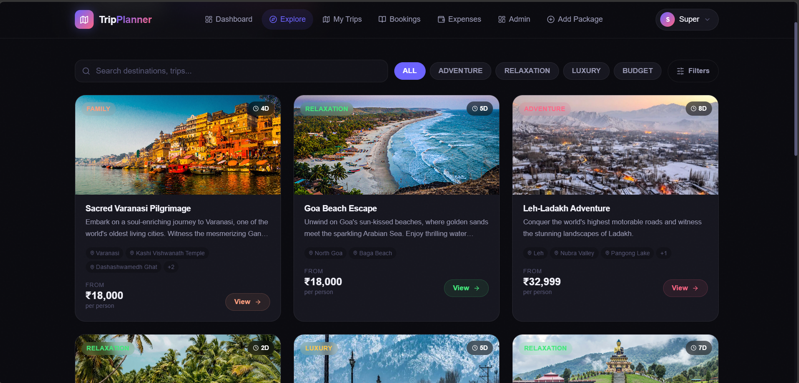
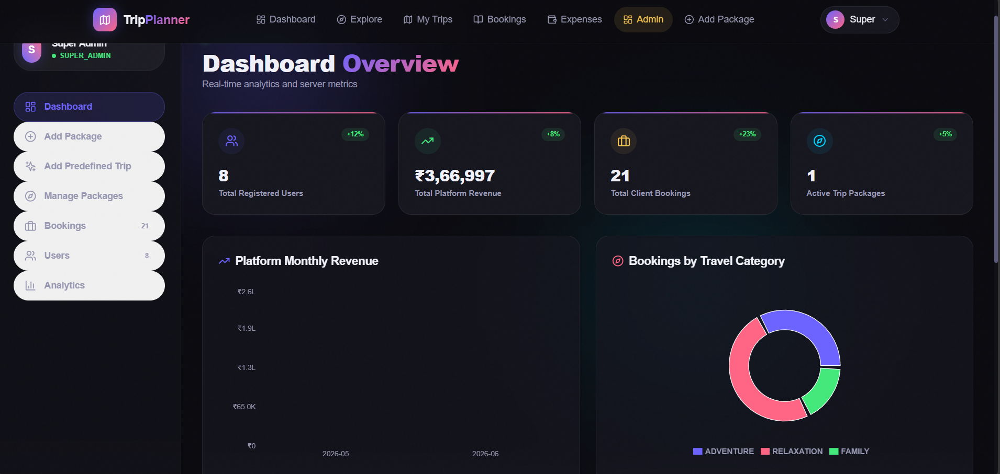
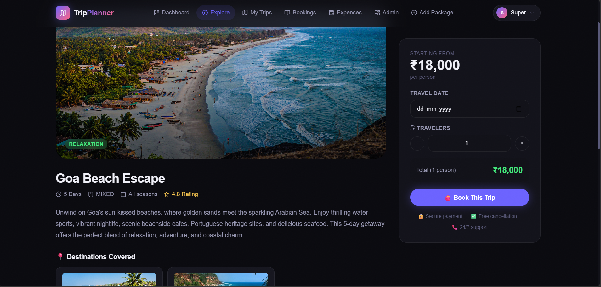
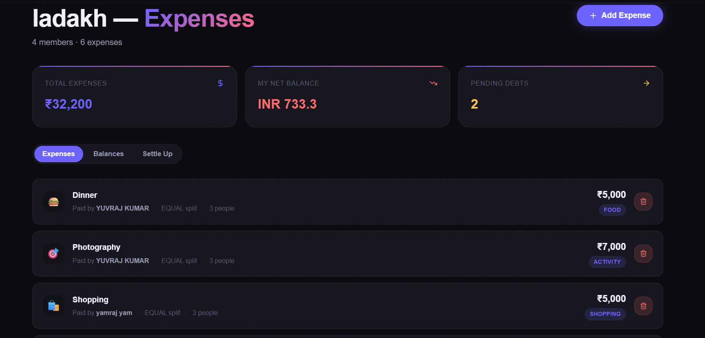
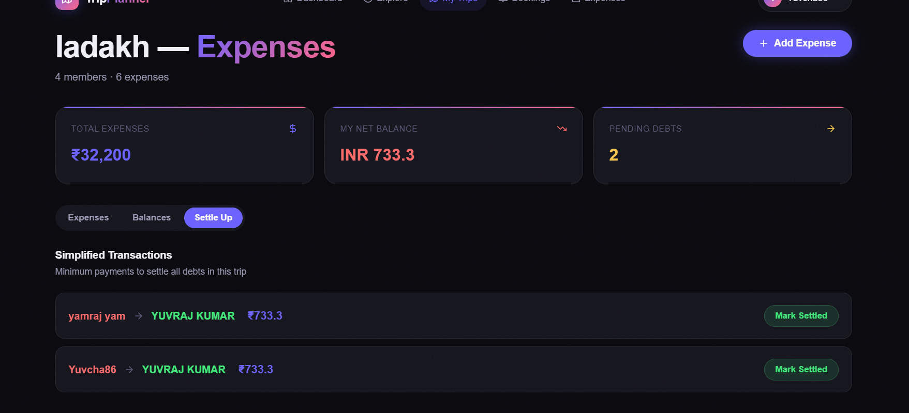

<div align="center">


# 🌍 TripPlanner

### *Plan Trips. Split Bills. No Stress.*

The most beautiful way to discover destinations, track group expenses, and settle debts instantly.

[](https://smart-trip-planner-pq2z.vercel.app)
[](https://azure.microsoft.com)
[](https://spring.io/projects/spring-boot)
[](https://reactjs.org)
[](https://azure.microsoft.com/en-us/products/mysql)
[](https://www.docker.com)
[](https://razorpay.com)

</div>

---

## 📸 Screenshots

| Landing Page | Explore Packages | Admin Dashboard |
|---|---|---|
|  |  |  |

| Trip Details | Expense Splitting | Settle Up |
|---|---|---|
|  |  |  |

---

## ✨ Features

### 🔐 Role-Based Authentication
- **User** — Plan personal trips, book packages, track expenses
- **Admin** — Create/manage predefined trips & packages, view platform analytics
- **Super Admin** — Full platform control, user management, revenue analytics
- JWT-based auth with **Google OAuth2** sign-in support
- Secure password change via profile settings

### 🗺️ Explore & Book Packages
- Browse predefined trips curated by admins (Varanasi Pilgrimage, Goa Beach Escape, Leh-Ladakh Adventure, etc.)
- Filter by **category** (Adventure, Relaxation, Luxury, Budget, Family, Spiritual), **budget range**, **duration**, **season**, and **transport mode**
- Each package shows tag badges (e.g. `ADVENTURE 8D`), destinations, price per person
- Dynamic pricing — cost updates based on **number of travelers**
- **Razorpay payment gateway** integration for seamless checkout
- Full **booking history** — confirmed, upcoming, and past bookings with cancel option

### 🧳 My Trips (Custom Trip Planning)
- Create personal trips with title, description, dates, budget range, travelers, trip type, and transport mode
- Invite friends/family **by email** to join a trip
- Trip status lifecycle: `PLANNING → ONGOING → COMPLETED`

### 💸 Expense Splitting (Splitwise-style)
- Add expenses with description, amount (₹), and category (Food, Transport, Accommodation, Activities, etc.)
- Split types: **Equal split** across selected participants
- **Balances tab** — see who paid what, who owes what, net balance per member
- **Settle Up tab** — algorithmically calculated **simplified transactions** (minimum payments to settle all debts)
- Mark individual settlements as **settled**
- Real-time net balance indicator (green = gets back, red = owes)

### 👑 Admin Panel
- Dashboard with live stats: Total Users, Total Revenue (₹), Total Bookings, Active Packages
- **Platform Monthly Revenue** chart
- **Bookings by Travel Category** donut chart
- Add Package, Add Predefined Trip, Manage Packages
- View all users and bookings with counts

---

## 🏗️ Tech Stack

| Layer | Technology |
|---|---|
| **Frontend** | React 18, JavaScript, CSS |
| **Backend** | Spring Boot 3, Java 17 |
| **Security** | Spring Security, JWT (jjwt 0.11.5), OAuth2 (Google) |
| **Database** | MySQL (Azure Flexible Server) |
| **ORM** | Spring Data JPA / Hibernate |
| **Payments** | Razorpay Java SDK |
| **API Docs** | SpringDoc OpenAPI / Swagger UI |
| **Validation** | Spring Validation, Lombok |
| **Frontend Deploy** | Vercel |
| **Backend Deploy** | Azure App Service (Docker container) |
| **Containerization** | Docker (multi-stage build) |

---

## 🚀 Getting Started

### Prerequisites

- Java 17+
- Node.js 18+
- MySQL 8+
- Maven 3.9+
- Docker (optional)

### 1. Clone the Repository

```bash
git clone https://github.com/YuvrajKumar2004/Smart_Trip_Planner.git
cd Smart_Trip_Planner
```

### 2. Database Setup

```sql
CREATE DATABASE smart_trip_planner;
```

### 3. Backend Configuration

Create `src/main/resources/application-local.properties`:

```properties
spring.datasource.url=jdbc:mysql://localhost:3306/smart_trip_planner
spring.datasource.username=your_db_user
spring.datasource.password=your_db_password

app.jwt.secret=your-very-long-secret-key-minimum-512-bits
app.cors.allowed-origins=http://localhost:3000

# Google OAuth2
spring.security.oauth2.client.registration.google.client-id=YOUR_GOOGLE_CLIENT_ID
spring.security.oauth2.client.registration.google.client-secret=YOUR_GOOGLE_CLIENT_SECRET

# Razorpay
razorpay.key.id=YOUR_RAZORPAY_KEY_ID
razorpay.key.secret=YOUR_RAZORPAY_KEY_SECRET
```

### 4. Run the Backend

```bash
./mvnw spring-boot:run
```

Backend runs on `http://localhost:8080`  
Swagger UI: `http://localhost:8080/swagger-ui.html`

### 5. Frontend Setup

```bash
cd frontend
npm install
```

Create `frontend/.env`:

```env
REACT_APP_API_URL=http://localhost:8080
REACT_APP_RAZORPAY_KEY_ID=your_razorpay_key_id
```

```bash
npm start
```

Frontend runs on `http://localhost:3000`

---

## 🐳 Docker

### Build & Run with Docker

```bash
# Build the image
docker build -t smart-trip-planner .

# Run the container
docker run -p 8080:8080 \
  -e DB_URL=jdbc:mysql://your-db-host:3306/smart_trip_planner \
  -e DB_USERNAME=your_user \
  -e DB_PASSWORD=your_password \
  -e JWT_SECRET=your_jwt_secret \
  -e RAZORPAY_KEY_ID=your_key \
  -e RAZORPAY_KEY_SECRET=your_secret \
  smart-trip-planner
```

### Docker Compose (Full Stack)

```bash
docker-compose up --build
```

---

## ☁️ Deployment

| Component | Platform | Details |
|---|---|---|
| Frontend | **Vercel** | Auto-deploy from `main` branch, `frontend/` directory |
| Backend | **Azure App Service** | Docker container deployed via Azure Container Registry |
| Database | **Azure Database for MySQL Flexible Server** | Managed MySQL 8.0 |

### Environment Variables (Production)

| Variable | Description |
|---|---|
| `DB_URL` | Azure MySQL JDBC URL |
| `DB_USERNAME` | Database username |
| `DB_PASSWORD` | Database password |
| `JWT_SECRET` | JWT signing secret (min 512 bits) |
| `GOOGLE_CLIENT_ID` | Google OAuth2 Client ID |
| `GOOGLE_CLIENT_SECRET` | Google OAuth2 Client Secret |
| `RAZORPAY_KEY_ID` | Razorpay Key ID |
| `RAZORPAY_KEY_SECRET` | Razorpay Key Secret |
| `CORS_ALLOWED_ORIGINS` | Frontend URL (e.g. `https://smart-trip-planner-pq2z.vercel.app`) |
| `OAUTH2_REDIRECT_URIS` | OAuth2 callback URL |

---

## 📁 Project Structure

```
Smart_Trip_Planner/
├── src/
│   └── main/
│       ├── java/com/yuvraj/smarttrip/
│       │   ├── config/          # Security, CORS, Swagger config
│       │   ├── controller/      # REST API controllers
│       │   ├── dto/             # Request/Response DTOs
│       │   ├── entity/          # JPA entities
│       │   ├── exception/       # Global exception handling
│       │   ├── repository/      # Spring Data JPA repositories
│       │   ├── security/        # JWT, OAuth2, UserDetails
│       │   └── service/         # Business logic
│       └── resources/
│           ├── application.properties
│           └── application-prod.properties
├── frontend/
│   ├── public/
│   └── src/
│       ├── components/          # Reusable UI components
│       ├── pages/               # Route-level pages
│       ├── services/            # API service calls (Axios)
│       ├── context/             # React Context (Auth, etc.)
│       └── assets/              # Styles, images
├── .mvn/wrapper/
├── Dockerfile
├── docker-compose.yml
├── pom.xml
└── README.md
```

---

## 🔌 API Endpoints

### Auth
| Method | Endpoint | Description |
|---|---|---|
| POST | `/api/auth/register` | Register new user |
| POST | `/api/auth/login` | Login with email/password |
| GET | `/oauth2/callback/google` | Google OAuth2 callback |
| POST | `/api/auth/change-password` | Change user password |

### Trips
| Method | Endpoint | Description |
|---|---|---|
| GET | `/api/trips` | Get user's trips |
| POST | `/api/trips` | Create new trip |
| GET | `/api/trips/{id}` | Get trip details |
| PUT | `/api/trips/{id}` | Update trip |
| DELETE | `/api/trips/{id}` | Delete trip |
| POST | `/api/trips/{id}/members` | Add member by email |
| PUT | `/api/trips/{id}/start` | Start trip |

### Packages (Explore)
| Method | Endpoint | Description |
|---|---|---|
| GET | `/api/packages` | Get all packages (with filters) |
| GET | `/api/packages/{id}` | Get package details |
| POST | `/api/packages` | Create package (Admin+) |
| PUT | `/api/packages/{id}` | Update package (Admin+) |
| DELETE | `/api/packages/{id}` | Delete package (Admin+) |

### Bookings
| Method | Endpoint | Description |
|---|---|---|
| GET | `/api/bookings` | Get user's bookings |
| POST | `/api/bookings` | Create booking |
| PUT | `/api/bookings/{id}/cancel` | Cancel booking |

### Payments
| Method | Endpoint | Description |
|---|---|---|
| POST | `/api/payments/create-order` | Create Razorpay order |
| POST | `/api/payments/verify` | Verify payment signature |

### Expenses
| Method | Endpoint | Description |
|---|---|---|
| GET | `/api/trips/{id}/expenses` | Get trip expenses |
| POST | `/api/trips/{id}/expenses` | Add expense |
| DELETE | `/api/trips/{id}/expenses/{eid}` | Delete expense |
| GET | `/api/trips/{id}/expenses/balances` | Get member balances |
| GET | `/api/trips/{id}/expenses/settle` | Get simplified transactions |
| PUT | `/api/trips/{id}/expenses/settle/{sid}` | Mark settlement as settled |

### Admin
| Method | Endpoint | Description |
|---|---|---|
| GET | `/api/admin/stats` | Platform overview stats |
| GET | `/api/admin/users` | All users |
| GET | `/api/admin/bookings` | All bookings |
| GET | `/api/admin/revenue` | Monthly revenue data |

---

## 👤 User Roles

| Role | Capabilities |
|---|---|
| `USER` | Create trips, invite members, add expenses, explore & book packages, manage own bookings |
| `ADMIN` | All USER permissions + create/manage packages & predefined trips, view analytics |
| `SUPER_ADMIN` | All ADMIN permissions + manage all users, full platform data access |

---

## 🤝 Contributing

1. Fork the repository
2. Create your feature branch: `git checkout -b feature/amazing-feature`
3. Commit your changes: `git commit -m 'Add amazing feature'`
4. Push to the branch: `git push origin feature/amazing-feature`
5. Open a Pull Request

---

## 👨‍💻 Author

**Yuvraj Kumar**  
[](https://github.com/YuvrajKumar2004)

---

## 📄 License

This project is licensed under the MIT License.

---

<div align="center">
  <strong>Built with ❤️ using Spring Boot + React</strong><br/>
  <em>Deployed on Azure + Vercel</em>
</div>
